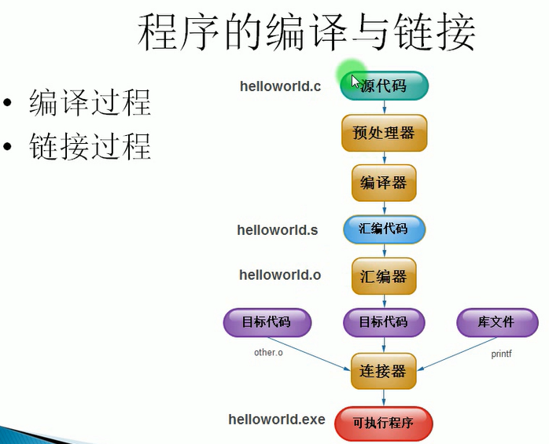
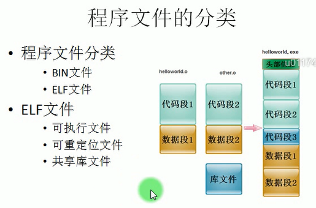

# makefile study

[git@github.com:zhangbinghua/makefile-study.git]()

## 程序的编译与链接




## 程序文件的分类



可重定位文件：helloworld.o

## Makefile的目的

- 构建依赖关系树

## 依赖关系树的生命周期

> - 解析阶段载入内存
> - 运行阶段根据其进行编译、根据时间戳生成文件
> - 有新文件添加、减少会动态改变依赖关系树

## 规则基本构成

目标：目标依赖

​	命令

注意事项：

- 命令必须使用tab键开头、一般是shell命令
- 一个规则中可以无目标依赖，仅仅实现某种操作
- 一个规则中可以没有命令，仅仅描述依赖关系
- 一个规则中必须有一个目标

### 目标

#### 默认目标

- 一个Makefile里可以有多个目标
- 一般会选择第一个作为默认目标

#### 多目标

- 一个规则中可以有多个目标
- 多个目标具有相同的生成命令和依赖文件

#### 多规则目标

- 多个规则可以是同一个目标
- Make在解析时，会将多个规则的依赖文件合并

#### 伪目标

- 并不是一个真正的文件名，可以看做是一个标签
- 无依赖，相比一般文件不会去重新生成、执行
- 伪目标，可以无条件执行

伪目标因为不是文件，为了避免和文件重名的这种情况，我们可以使用一个特殊的标记“.PHONY”来显示地指明一个目标是“伪目标”，向make说明，不管是否有这个文件，这个目标就是“伪目标”

### 文件时间戳

- 根据时间戳来判断目标依赖文件是否更新
- 所有文件编译过，则对所有文件编译，生成可执行程序
- 在上次make之后修改过的C文件，会被重新编译
- 在上次make之后修改过的头文件，依赖此头文件的会被重新编译

### 自动产生依赖

- Gcc –M命令生成该文件要依赖的文件，会带系统依赖文件
- gcc -MM，只显示当前工程目录的依赖文件

```shell
zhangbh@ubuntu2004:<2-4$> gcc -M hello.c 
hello.o: hello.c /usr/include/stdc-predef.h /usr/include/stdio.h \
 /usr/include/x86_64-linux-gnu/bits/libc-header-start.h \
 /usr/include/features.h /usr/include/x86_64-linux-gnu/sys/cdefs.h \
 /usr/include/x86_64-linux-gnu/bits/wordsize.h \
 /usr/include/x86_64-linux-gnu/bits/long-double.h \
 /usr/include/x86_64-linux-gnu/gnu/stubs.h \
 /usr/include/x86_64-linux-gnu/gnu/stubs-64.h \
 /usr/lib/gcc/x86_64-linux-gnu/9/include/stddef.h \
 /usr/lib/gcc/x86_64-linux-gnu/9/include/stdarg.h \
 /usr/include/x86_64-linux-gnu/bits/types.h \
 /usr/include/x86_64-linux-gnu/bits/timesize.h \
 /usr/include/x86_64-linux-gnu/bits/typesizes.h \
 /usr/include/x86_64-linux-gnu/bits/time64.h \
 /usr/include/x86_64-linux-gnu/bits/types/__fpos_t.h \
 /usr/include/x86_64-linux-gnu/bits/types/__mbstate_t.h \
 /usr/include/x86_64-linux-gnu/bits/types/__fpos64_t.h \
 /usr/include/x86_64-linux-gnu/bits/types/__FILE.h \
 /usr/include/x86_64-linux-gnu/bits/types/FILE.h \
 /usr/include/x86_64-linux-gnu/bits/types/struct_FILE.h \
 /usr/include/x86_64-linux-gnu/bits/stdio_lim.h \
 /usr/include/x86_64-linux-gnu/bits/sys_errlist.h
```

```shell
zhangbh@ubuntu2004:<2-4$> gcc -MM hello.c 
hello.o: hello.c
```

### 隐式规则

### 模式匹配

#### 命令的组成

- Shell命令组成、tab键开头

#### 命令的执行

- 每条命令，make会开一个进程
- 每条命令执行完，make会检测每个命令的返回码 0为成功，1为失败
- 若命令返回成功，make继续执行下个命令
- 若命令执行出错，make会终止执行当前规则，退出

#### 并发执行命令

#### 命令同一进程执行

错误写法：

```makefile
all:
	cd /
	pwd
```

执行make结果：

```shell
cd /
pwd
/home/zhangbh/linux_kernel/TbusOS/to_zhangzong/makefile-test/makefile-study/2-1
```

正确写法

```makefile
all:
	cd /; \
	pwd
```

执行make结果：

```shell
cd /; \
pwd
/
```

## 变量

### 变量定义

​	CC= gcc

变量赋值

- ​	追加赋值：+=

- ​	条件赋值：?=

  如果变量没有被赋值过，则赋值，如果变量被赋值过，则采用上一次赋值的值，当前的值不会被赋值

- ​	变量引用

  ​	$(CC) ${CC}

例子：

```makefile
STR = hello
STR2 = hello
STR2 += world!

test1 = a
test1 ?= b
test2 ?= b

all:
	@echo "STR = $(STR)"
	@echo "STR2 = $(STR2)"
	@echo "test1 = $(test1)"
	@echo "test2 = $(test2)"
```

输出结果

```shell
STR = hello
STR2 = hello world!
test1 = a
test2 = b
```


### 变量分类

2-3-2

#### 立即展开变量

- ​	使用**:=**操作符赋值
- ​	==在解析阶段==直接赋值==常量字符串==

#### 延迟展开变量

- ​	使用**=**操作符赋值
- ​	==在运行阶段==，实际使用变量时再进行求值

注意事项

- ​	一般在目标、目标依赖中使用立即展开变量
- ​	在命令中一般使用延迟展开变量

立即展开变量例子

```makefile
.PHONY:all

HELLO = Good
TIME = morning!
#STRING = $(HELLO) $(TIME)
STRING := $(HELLO) $(TIME)
$(info $(STRING))
TIME = afternoon!
$(info $(STRING))

all:
	@echo "done"
```

输出结果

```
Good morning!
Good morning!
done
```

延迟展开变量例子

```makefile
.PHONY:all

HELLO = Good
TIME = morning!
STRING = $(HELLO) $(TIME)
$(info $(STRING))
TIME = afternoon!
$(info $(STRING))

all:
	@echo "done"
```

输出结果

```shell
Good morning!
Good afternoon!
done
```

2-3-3

#### 一般变量

- 默认为全局变量

#### 目标变量

- 该目标所依赖的规则中都可以使用

#### 使用目标变量用途

- 做到文件级的编译选项

例子：

```makefile
.PHONY:clean

OBJS = player.o lcd.o
BIN  = mp3
N = 1
$(BIN): N = 2
$(BIN):$(OBJS)
	@echo "BIN: N = $(N)"
	gcc -o $(BIN) $(OBJS)
player.o:N= 3
player.o:player.c
	@echo "player.o: N = $(N)"
	gcc -o player.o -c player.c
lcd.o:lcd.c
	@echo "lcd.o: N = $(N)"
	gcc -o lcd.o -c lcd.c
clean:
	@echo "clean: N = $(N)"
	rm -f  $(BIN) $(OBJS)
```

执行输出：

```
player.o: N = 3
gcc -o player.o -c player.c
lcd.o: N = 2 
gcc -o lcd.o -c lcd.c
BIN: N = 2
gcc -o mp3 player.o lcd.o
```

lcd.o : N=2的原因是因为$(BIN)：N=2，而BIN依赖了lcd.o，因此lcd.o的N=2

对于目标变了，该目标所依赖的规则中都可以使用

#### 模式变量

2-3-4

目标变量

- 变量可以定义在某个目标上

模式变量

- 变量可以定义在符合某种模式的目标上

```makefile
.PHONY:clean
N = 1
OBJS = player.o lcd.o
BIN  = mp3
$(BIN):$(OBJS)
	@echo "BIN:N=$(N)"
	gcc -o $(BIN) $(OBJS)
$(BIN): N = 2
%.o: N = 3
player.o:player.c
	@echo "player.o:N=$(N)"
	gcc -o player.o -c player.c
lcd.o:lcd.c
	@echo "lcd.o:N=$(N)"
	gcc -o lcd.o -c lcd.c
clean:
	@echo "clean: N = $(N)"
	rm  $(BIN) $(OBJS)
```

```shell
player.o:N=3
gcc -o player.o -c player.c
lcd.o:N=3
gcc -o lcd.o -c lcd.c
BIN:N=2
gcc -o mp3 player.o lcd.o
```

#### 自动变量

2-3-5

自动变量是局部变量

目标

- $@

所有目标依赖

- $^

第一个依赖

- $<

使用举例

- gcc -o $@ $^

例子1：

```makefile
.PHONY:clean
OBJS = player.o lcd.o
BIN  = mp3
$(BIN):$(OBJS)
	@echo "BIN------------$@:$^"
	gcc -o $@ $^ 
player.o:player.c
	@echo "------------$@:$^"
	gcc -o $@ -c $^
lcd.o:lcd.c
	@echo "---------$@:$^"
	gcc -o $@ -c $^
clean:
	rm -f $(BIN) $(OBJS)
```

```shell
------------player.o:player.c
gcc -o player.o -c player.c
---------lcd.o:lcd.c
gcc -o lcd.o -c lcd.c
BIN------------mp3:player.o lcd.o
gcc -o mp3 player.o lcd.o 
```

例子2：

```makefile
.PHONY: clean
BIN:= mp3
OBJS:= player.o lcd.o
CC = gcc

$(BIN): $(OBJS)
	$(CC) -o $@ $^

%.o: %.c
	$(CC) -o $@ -c $^

clean:
	rm -f $(BIN) $(OBJS)
```

```shell
gcc -o player.o -c player.c
gcc -o lcd.o -c lcd.c
gcc -o mp3 player.o lcd.o
```

#### 系统环境变量

2-3-6

作用范围

- 变量在make开始运行时被载入到Makefile文件中
- 对所有的Makefile都有效。
- 若Makefile中定义同名变量，系统环境变量将被覆盖
- 命令行中传递同名变量，系统环境变量将被覆盖

常见的系统环境变量

- CFLAGS
- SHELL
- MAKE

```makefile
.PHONY:all
CFLAGS = -g
all:
	@echo "CFLAGS = $(CFLAGS)"
	@echo "SHELL = $(SHELL)"
	@echo "MAKE = $(MAKE)"
	@echo "HOSTNAME = $(HOSTNAME)"
```

```shell
zhangbh@ubuntu2004:<2-3-6$> make MAKE=nmake
CFLAGS = -g
SHELL = /bin/sh
MAKE = nmake
HOSTNAME = 
```

#### 变量的传递

- Makefile在多目录下递归执行

> $(MAKE) –C subdir
> cd subdir && $(MAKE)

- 通过export传递变量
- 通过命令行传递变量

## 条件判断

- 关键字

> ifeq、else、endif
>
> ifneq

- 使用

> 条件语句从ifeq开始，括号与关键字用空格隔开

```makefile
.PHONY:all

DEBUG = true
ifeq ($(DEBUG),true)
VERSION = debug
CC = gcc -g
else
VERSION = release
CC = gcc
endif

hello:hello.c
	@echo "build $(VERSION) mode"
	$(CC) -o $@ $^
clean:
	rm hello
```

```shell
build debug mode
gcc -g -o hello hello.c
```

## 函数

### 文本处理函数

```makefile
.PHONY:all
SRCS = player.c lcd.c usb.c media.c hello.h main.txt
#函数名称：字符串替换函数—subst。 
#函数功能：把字串“TEXT”中的“FROM”字符替换为“TO”。 
#返回值：替换后的新字符串。
OBJS = $(subst .c,.o,$(strip $(SRCS)))
#数名称：模式替换函数—patsubst。 
#函数功能：搜索“TEXT”中以空格分开的单词，将否符合模式“TATTERN”替换
#为“REPLACEMENT”。参数“PATTERN”中可以使用模式通配符“%”
#来代表一个单词中的若干字符。如果参数“REPLACEMENT”中也包含
#一个“%”，那么“REPLACEMENT”中的“%”将是“TATTERN”中
#的那个“%”所代表的字符串。在“TATTERN”和“REPLACEMENT”
#中，只有第一个“%”被作为模式字符来处理，之后出现的不再作模式
#字符（作为一个字符）。在参数中如果需要将第一个出现的“%”作为字
#符本身而不作为模式字符时，可使用反斜杠“\”进行转义处理（转义处
#理的机制和使用静态模式的转义一致，具体可参考 5.12.1 静态模式规则的
#语法 一小节）。 
#返回值：替换后的新字符串。 
#函数说明：参数“TEXT”单词之间的多个空格在处理时被合并为一个空格，并忽略
#前导和结尾空格。
DEPS = $(patsubst %.c,%.d,$(SRCS))
DEPS2 = $(SRCS:.c=.d)
FIND = $(findstring usb,$(SRCS))
FILTER = $(filter %.c %.h, $(SRCS))
FILTER_OUT = $(filter-out %.c %.h, $(SRCS))

all:
	@echo "OBJS = $(OBJS)"	
	@echo "DEPS = $(DEPS)"
	@echo "DEPS2 = $(DEPS2)"
	@echo "FIND = $(FIND)"
	@echo "FILTER = $(FILTER)"
	@echo "FILTER_OUT = $(FILTER_OUT)"
```

```shell
OBJS = player.o lcd.o usb.o media.o hello.h main.txt
DEPS = player.d lcd.d usb.d media.d hello.h main.txt
DEPS2 = player.d lcd.d usb.d media.d hello.h main.txt
FIND = usb
FILTER = player.c lcd.c usb.c media.c hello.h
FILTER_OUT = main.txt
```

### 文件名处理函数

```makefile
.PHONY:all
LIB = /home/hello/libhello.a
#函数名称：取目录函数—dir。 
#函数功能：从文件名序列“NAMES…”中取出各个文件名的目录部分。文件名的目
#录部分就是包含在文件名中的最后一个斜线（“/”）（包括斜线）之前的部分。 
#返回值：空格分割的文件名序列“NAMES…”中每一个文件的目录部分。 
#函数说明：如果文件名中没有斜线，认为此文件为当前目录（“./”）下的文件。
LIB1 = $(dir $(LIB))
#函数名称：取文件名函数——notdir。 
#函数功能：从文件名序列“NAMES…”中取出非目录部分。目录部分是指最后一个
#斜线（“/”）（包括斜线）之前的部分。删除所有文件名中的目录部分，
#只保留非目录部分。 
#返回值：文件名序列“NAMES…”中每一个文件的非目录部分。 
#函数说明：如果“NAMES…”中存在不包含斜线的文件名，则不改变这个文件名。
#以反斜线结尾的文件名，是用空串代替，因此当“NAMES…”中存在多
#个这样的文件名时，返回结果中分割各个文件名的空格数目将不确定！
#这是此函数的一个缺陷。 
LIB2 = $(notdir $(LIB))
#函数名称：取后缀函数—suffix。 
#函数功能：从文件名序列“NAMES…”中取出各个文件名的后缀。后缀是文件名中
#最后一个以点“.”开始的（包含点号）部分，如果文件名中不包含一个
#点号，则为空。 
#返回值：以空格分割的文件名序列“NAMES…”中每一个文件的后缀序列。 
#函数说明：“NAMES…”是多个文件名时，返回值是多个以空格分割的单词序列。
#如果文件名没有后缀部分，则返回空。 
LIB3 = $(suffix $(LIB))
#函数名称：取前缀函数—basename。 
#函数功能：从文件名序列“NAMES…”中取出各个文件名的前缀部分（点号之后的
#部分）。前缀部分指的是文件名中最后一个点号之前的部分。 
#返回值：空格分割的文件名序列“NAMES…”中各个文件的前缀序列。如果文件没
#有前缀，则返回空字串。 
#函数说明：如果“NAMES…”中包含没有后缀的文件名，此文件名不改变。如果一
#个文件名中存在多个点号，则返回值为此文件名的最后一个点号之前的
#文件名部分。 
LIB4 = $(basename $(LIB))
#函数名称：加后缀函数—addsuffix。 
#函数功能：为“NAMES…”中的每一个文件名添加后缀“SUFFIX”。参数“NAMES…”
#为空格分割的文件名序列，将“SUFFIX”追加到此序列的每一个文件名
#的末尾。 
#返回值：以单空格分割的添加了后缀“SUFFIX”的文件名序列。 
LIB5 = $(addsuffix .c,$(LIB4))
#函数名称：加前缀函数—addprefix。 
#函数功能：为“NAMES…”中的每一个文件名添加前缀“PREFIX”。参数“NAMES…”
#是空格分割的文件名序列，将“SUFFIX”添加到此序列的每一个文件名
#之前。 
#返回值：以单空格分割的添加了前缀“PREFIX”的文件名序列。 
LIB6 = $(addprefix /usr/lib/,$(LIB2))
#函数名称：获取匹配模式文件名函数—wildcard 
#函数功能：列出当前目录下所有符合模式“PATTERN”格式的文件名。 
#返回值：空格分割的、存在当前目录下的所有符合模式“PATTERN”的文件名。 
#函数说明：“PATTERN”使用shell可识别的通配符，包括“?”（单字符）、“*”（多
#字符）等。
SRCS = $(wildcard *.c)
all:
	@echo "LIB1 = $(LIB1)"
	@echo "LIB2 = $(LIB2)"
	@echo "LIB3 = $(LIB3)"
	@echo "LIB4 = $(LIB4)"
	@echo "LIB5 = $(LIB5)"
	@echo "LIB6 = $(LIB6)"	
	@echo "SRCS = $(SRCS)"
```

```shell
LIB1 = /home/hello/
LIB2 = libhello.a
LIB3 = .a
LIB4 = /home/hello/libhello
LIB5 = /home/hello/libhello.c
LIB6 = /usr/lib/libhello.a
SRCS = 3.c hello.c main.c
```

### 其他函数

#### foreach函数

```makefile
A = 1 3 4 5 6 7 8 9
B = $(foreach i,$(A),$(addprefix 0.,$(i)))
C = $(foreach i,$(A),$(addsuffix .0,$(i)))

all:
	@echo "A = $(A)"
	@echo "B = $(B)"
	@echo "C = $(C)"
```

```shell
zhangbh@ubuntu2004:<foreach$> make
A = 1 3 4 5 6 7 8 9
B = 0.1 0.3 0.4 0.5 0.6 0.7 0.8 0.9
C = 1.0 3.0 4.0 5.0 6.0 7.0 8.0 9.0
```

#### shell函数

```makefile
.PHONY:all clean
$(shell mkdir -p s1)
$(shell mkdir -p s2)
all:
	@echo "hello world"
clean:
	rm -r s1 s2
```

```shell
zhangbh@ubuntu2004:<shell$> make 
hello world
zhangbh@ubuntu2004:<shell$> ls
makefile  s1  s2
zhangbh@ubuntu2004:<shell$> tree
.
├── makefile
├── s1
└── s2

2 directories, 1 file
```

# 库的生成和使用


## 静态库的生成和使用

```shell
zhangbh@ubuntu2004:<tmp$> ls
hello.c  hello.h  hello.o  libhello.a  main.c  test
zhangbh@ubuntu2004:<tmp$> gcc -o hello.o -c hello.c
zhangbh@ubuntu2004:<tmp$> ar rcs libhello.a hello.o
zhangbh@ubuntu2004:<tmp$> gcc -o test main.c -L./ -lhello
zhangbh@ubuntu2004:<tmp$> ./test 
hello main!
hello
```

## 动态库的生成和使用


# Makefile的执行过程

## 执行过程

- 进入编译目录，执行make命令
- 依赖关系解析阶段
- 命令运行阶段

## 依赖关系解析阶段

​	步骤

- 解析Makefile，建立依赖关系图
- 控制解析过程：引入Makefile、变量展开、条件执行
- 生成依赖关系树

## 规则的执行

- 把解析生成的依赖关系树加载到内存

- 按照依赖关系，按顺序生成这些文件

- 再次编译Make会检查文件时间戳，判断是否过期

  ​	–若无过期，不再编译

  ​	–若文件有更新，则依赖该文件的所有依赖关系上的目标重新更新、编译生成

## Make的执行结果

Make的退出码

> 0：表示成功执行
>
> 1：运行错误，make返回1，当然也会返回其他代码，需查手册确认返回值

# Makefile隐含规则

## 隐含规则

make默认将.c文件编译成对应的.o目标文件

对没有命令行的规则

- 寻找一个隐含的规则来执行

取消隐含规则

- 使用-r 或-R参数取消隐含规则

```
zhangbh@ubuntu2004:<2-8$> cat 2-8-1/makefile 
.PHONY:clean

hello:hello.o
	gcc -o hello hello.o
#hello.o:hello.c
#	gcc -o $@ -c $^
clean:
	rm hello hello.o
```

## 隐含变量

### 命令变量

> CC：编译程序，默认是cc
>
> AS：汇编程序，默认是as
>
> CXX：C++编译程序，默认g++
>
> AR：函数库打包程序，默认是ar

### 命令参数变量

> CFLAGS：执行CC编译器的命令行参数
>
> CXXFLAGS：执行g++编译器命令行参数
>
> ASFLAGS：执行汇编器AS命令行参数
>
> ARFLAGS：执行AR命令行参数
>
> 更多参数：LDFLAGS、CPPFLAGS

## 模式规则

### 使用模式规则来定义一个隐式规则

- 模式规则，至少在规则的目标定义中包含%
- %：任意长度的非空字符串，表示对文件名的匹配
- 在目标文件名中，%匹配的部分称为“茎”

### 目标和目标依赖同时含有%

- 依赖目标的茎会传给目标

### 多目标模式规则

- 同一个模式规则可以存在多个目标
- 普通多目标规则：每个目标作为一个独立规则处理；多个目标对应多个独立规则。
- 多目标模式规则：所有规则目标共同拥有依赖文件和规则的命令行，当文件符合多个目标模式中的任何一个时，规则定义的命令执行

例子：

```makefile
zhangbh@ubuntu2004:<3.1$> ls
lcd.c  lcd.h  makefile  media.c  media.h  player.c  usb.c  usb.h
zhangbh@ubuntu2004:<3.1$> cat makefile 
.PHONY:all clean

SRCS = $(wildcard *.c)
OBJS = $(SRCS:.c=.o)
BIN  = mp3
all: $(BIN)

$(BIN):$(OBJS)
	@echo "SRCS =$(SRCS)"
	@echo "OBJS =$(OBJS)"
	gcc -o $@ $^
%.o:%.c
	gcc -o $@ -c $^
clean:
	rm -f  $(BIN) $(OBJS)
```

```shell
zhangbh@ubuntu2004:<3.1$> make
gcc -o lcd.o -c lcd.c
gcc -o player.o -c player.c
gcc -o usb.o -c usb.c
gcc -o media.o -c media.c
SRCS =lcd.c player.c usb.c media.c
OBJS =lcd.o player.o usb.o media.o
gcc -o mp3 lcd.o player.o usb.o media.o
```

# 深入理解软件构造系统:原理与最佳实践

